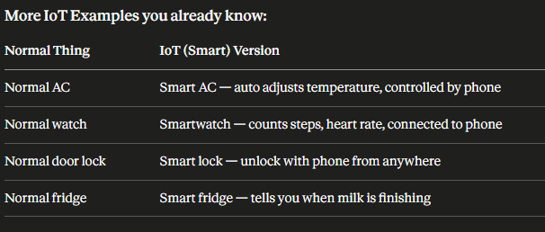

# Let's Start — Module 7 (Last Chapter)

### First, ONE question for you:

Do you use WiFi at home or mobile internet (like Jio/Airtel)?
Yes, of course you do! 😄
That WiFi or mobile data — that is a NETWORK.
A network = two or more devices connected to share information.
Your phone talks to YouTube server = Network.
Your phone talks to WhatsApp server = Network.
That's it. That is networking.

### Now — Topic 1: Cloud Networking

Forget "cloud" for a second. Think of this:
You have important photos on your phone.
Your phone falls in water. 💀
All photos gone forever.
Now imagine — what if your photos were also saved on Google Photos?
Even if phone dies, photos are safe. You open any other phone, photos are there.
That saving on Google Photos = Cloud.
So Cloud means:

Storing and using things on someone else's powerful computer (server), through the internet.

Not on YOUR computer. On THEIR computer. You just use it from anywhere.

Real Life Examples of Cloud:
What you useCloud service behind it Gmail Google's cloud Google Drive Google's cloud WhatsApp backup Facebook/Meta cloudNetflix moviesAmazon cloud (AWS)

### Now — 3 Types of Cloud Service

Think of it like RENTING A HOUSE 🏠

Type 1 — IaaS (Infrastructure as a Service)
You rent an empty flat.
No furniture. No nothing.
You bring everything yourself — furniture, appliances, decoration.
→ In networking: You get a virtual computer/server. You install everything yourself.
→ Example: Amazon AWS EC2 (companies rent virtual computers)

Type 2 — PaaS (Platform as a Service)
You rent a flat that has basic furniture already — bed, kitchen, bathroom.
You just bring your clothes and personal items.
→ In networking: You get a ready platform to build your app. No need to set up servers.
→ Example: Google App Engine (developers just write code, rest is handled)

Type 3 — SaaS (Software as a Service)
You go to a hotel.
Everything is ready — room, food, cleaning service.
You just come and use it.
→ In networking: Software is fully ready. Just open and use.
→ Example: Gmail, Netflix, Zoom

Memory Trick for IaaS, PaaS, SaaS:

"I Pay Some"
I = IaaS
P = PaaS
S = SaaS

And remember the house story —
Empty flat → Furnished flat → Hotel

### Now — 3 Types of Cloud Deployment

This means — who can use this cloud?

Public Cloud = Anyone can use it. Open to all.
Example: Google Drive — anyone with Google account can use.

Private Cloud = Only ONE company uses it. Others cannot.
Example: A bank's own cloud — only bank employees use it. Very secure.

Hybrid Cloud = Mix of both.
Example: A company keeps secret data on private cloud, but runs website on public cloud.
Memory trick:

Think of a swimming pool 🏊
Public pool = anyone can swim
Private pool = only your family swims
Hybrid pool = family pool + sometimes open for guests

## Topic 2 — IoT (Internet of Things)

First, a simple question:
You know a normal bulb right?
You press switch → bulb ON.
You press switch → bulb OFF.
That's it. Bulb is dumb. It can't do anything itself.

Now imagine —
A smart bulb that:

You can turn ON/OFF from your phone
Even when you are in another city
It automatically turns OFF when you leave the room
It changes color based on your mood

How? Because this bulb is connected to the INTERNET.

That is IoT — Internet of Things
Normal dumb objects (things) + Internet = Smart objects

More IoT Examples you already know:

So IoT means:

Everyday objects connected to internet, talking to each other and sending data.

Your fitness band → sends steps data → to your phone → to cloud server.
That whole chain = IoT.

Now — HOW do these IoT devices talk to each other?
They use special protocols (rules for communication).
Two main protocols in your syllabus:

MQTT
CoAP

## MQTT — Super Simple Explanation

Think of a Newspaper System 📰
There is a newspaper company (they write and publish news).
There is a newspaper agent in your area (middleman).
There is you (you subscribed to get newspaper daily).
Every morning — newspaper company sends news to agent.
Agent delivers to all subscribers (including you).
You don't call the newspaper company directly.
The agent handles everything.

MQTT works EXACTLY like this:
Newspaper WorldMQTT WorldNewspaper CompanyPublisher (e.g. temperature sensor)Newspaper AgentBroker (middleman — e.g. Mosquitto software)You (subscriber)Subscriber (e.g. your phone app)

Real Example:
Your room has a temperature sensor (IoT device).

Sensor measures temperature = 30 degrees
Sensor publishes this to the Broker
Your phone app has subscribed to temperature updates
Broker sends 30 degrees to your phone automatically

You didn't ask. It just came. Because you subscribed.

## MQTT Key Points for Exam:

    Point          |   Answer                              |

---

Full form | Message Queuing Telemetry Transport |
Model | Publish / Subscribe |
Transport used | TCP |
Used for | IoT, smart home, sensors |
Port number | 1883 |

---

MQTT QoS (Quality of Service) — Very Simple:
Think of sending a letter 📨
QoS 0 — You drop letter in postbox. Maybe it reaches, maybe not. You don't care.
QoS 1 — You send and keep sending until you get confirmation it reached. But may reach twice.
QoS 2 — You make sure it reaches exactly once. Not lost, not duplicate.
Memory trick:

0 = Don't care
1 = At least reaches
2 = Reaches perfectly

CoAP — Even Simpler!
Think of making a Phone Call ☎️
You call your friend.
Friend picks up and answers.
Done.
You asked → You got answer. Simple back and forth.

CoAP works like this:
Your phone requests → "Hey sensor, what is temperature?"
Sensor replies → "It is 30 degrees."
That's it. Request → Response.
Just like how websites work (HTTP) but MUCH smaller and lighter.
Because IoT devices are tiny — small battery, small memory.
They can't handle big heavy HTTP.
So CoAP = HTTP but for tiny devices.

One line memory trick:

MQTT = You subscribed, news comes automatically (newspaper)
CoAP = You call, you get answer (phone call)

### SDN — Software Defined Networking

First, think about a normal Army 🪖
In old times —
Every soldier on the battlefield made his own decisions.

Where to go
Who to attack
Which route to take

Problem? Total confusion. No coordination. Everyone doing their own thing.

Now modern army —
There is ONE General sitting in a control room.
He sees the WHOLE battlefield on a screen.
He gives orders to ALL soldiers.
Soldiers just follow orders. They don't think themselves.
Result? Perfect coordination. Much more powerful.

That is exactly SDN.

Now relate it to Networking:
Old/Traditional Network (Old Army):
Every router and switch in the network had its own brain.

Router decides itself where to send packets
Switch decides itself how to forward data
Each device is independent

Problem:

Hard to manage (100 routers = configure 100 routers one by one)
If you want to change something = go to EVERY device and change
Very slow and painful for big networks

SDN (Modern Army):
ONE central Controller (the General) controls ALL routers and switches.
Routers and switches become dumb workers.
They don't think. They just forward packets as the Controller tells them.
The Controller has the full picture of the network.
You want to change something? Change it in ONE place — the Controller.
Done. All devices updated automatically.

SDN has 3 Layers — Think of a Company 🏢

Top Floor — Application Layer
This is where the Boss/Manager sits.
He decides the RULES.
"Block Facebook in office network."
"Give more speed to video calls."
"If server 1 is busy, send traffic to server 2."
These are applications/software that tell the network what to do.

Middle Floor — Control Layer
This is the SDN Controller. The brain.
It receives orders from the top floor (applications).
It translates those orders into instructions for devices below.
Popular controllers: OpenDaylight, ONOS

Bottom Floor — Data Layer
These are the actual routers and switches.
They don't think. They just do what the Controller tells them.
They only job = forward packets.

The 3 layers together:
TOP → Application Layer → Boss gives rules
MIDDLE → Control Layer → Brain translates rules  
BOTTOM → Data Layer → Workers follow rules
Memory trick:

"A CD"
A = Application layer
C = Control layer
D = Data layer
Top to Bottom = A → C → D

How do these layers talk to each other?
Southbound API:
Controller talks DOWN to routers/switches.
South = Down (like south on a map is down)
The protocol used here = OpenFlow
Think of it as — Controller sending WhatsApp messages to all switches telling them what to do.

Northbound API:
Applications talk UP to the Controller.
North = Up (like north on a map is up)
Think of it as — Boss calling the Controller and saying "here are my rules."

Simple picture in your mind:
[Applications] ← Northbound API → talk UP to Controller
↕
[SDN Controller] ← Southbound API → talk DOWN to Switches
↕
[Routers/Switches]
Memory trick:

North = Up = Apps talk to Controller
South = Down = Controller talks to Switches

Traditional Network vs SDN — Exam Table:
PointTraditionalSDNControlEvery device has own brainONE central controllerManagementConfigure each device separatelyConfigure from one placeFlexibilityVery lowVery highCostHigh (expensive hardware)Low (cheap hardware)Speed of changesSlowFastLikeOld army (every soldier decides)Modern army (one general commands)

SDN Advantages (write these in exam):

Centralized control — manage whole network from one place
Easy to configure — change once, applies everywhere
Cost effective — no need for expensive smart hardware
Flexible — network can be programmed like software
Better traffic management — Controller sees full network, optimizes traffic

### === question and aswers of 7th chapter

2 Mark Questions

#### 1. What is IoT? Give 2 examples.

IoT (Internet of Things) is a network of physical devices connected to the internet that can collect, exchange, and process data automatically.

Examples:

Smart Home Devices (Smart Bulbs, Smart AC)
Smart Watches/Fitness Trackers

#### 2. What is MQTT? What model does it use?

MQTT (Message Queuing Telemetry Transport) is a lightweight messaging protocol designed for IoT devices and low-bandwidth networks.

It uses the Publish/Subscribe (Pub/Sub) model.

#### 3. What is SDN? Write full form.

SDN stands for Software Defined Networking.

It is a networking approach where the control of the network is separated from the hardware devices and managed through software.

#### 4. Difference between IaaS, PaaS, SaaS

| Service Model | Full Form                   | User Manages       | Example           |
| ------------- | --------------------------- | ------------------ | ----------------- |
| IaaS          | Infrastructure as a Service | OS, Applications   | AWS EC2           |
| PaaS          | Platform as a Service       | Applications only  | Google App Engine |
| SaaS          | Software as a Service       | Uses software only | Gmail             |

#### 5. What is a Broker in MQTT?

A Broker is the central server in MQTT that receives messages from publishers and forwards them to the appropriate subscribers.

Examples: Mosquitto, HiveMQ

#### 5–8 Mark Questions

##### 1. Explain SDN Architecture with 3 Layers.

SDN architecture consists of three layers:

1. Application Layer
   Contains network applications and services.
   Defines network policies and requirements.
   Examples: Load Balancing, Firewall Applications.
2. Control Layer
   Known as the SDN Controller.
   Acts as the brain of the network.
   Converts application requirements into network configurations.

Examples:

OpenDaylight
ONOS 3. Infrastructure Layer
Consists of switches, routers, and network devices.
Forwards packets according to controller instructions.

Diagram
+----------------------+
| Application Layer |
+----------------------+
|
+----------------------+
| Control Layer |
| (SDN Controller) |
+----------------------+
|
+----------------------+
| Infrastructure Layer |
| Switches & Routers |
+----------------------+
Advantages
Centralized management
Easy network configuration
Better scalability
Reduced operational cost 

##### 2. Compare MQTT and CoAP with a Table

| Feature             | MQTT                                | CoAP                             |
| ------------------- | ----------------------------------- | -------------------------------- |
| Full Form           | Message Queuing Telemetry Transport | Constrained Application Protocol |
| Communication Model | Publish/Subscribe                   | Request/Response                 |
| Transport Protocol  | TCP                                 | UDP                              |
| Reliability         | High                                | Moderate                         |
| Overhead            | Low                                 | Very Low                         |
| Best Use            | Sensor communication                | Device control                   |
| Broker Required     | Yes                                 | No                               |
| Power Consumption   | Low                                 | Very Low                         |

Conclusion
MQTT is best for data collection and monitoring systems.
CoAP is best for constrained devices with limited resources.

##### 3. Explain Cloud Computing Service Models with Examples.

Cloud computing provides computing resources over the internet.

A. IaaS (Infrastructure as a Service)

Provides virtual machines, storage, and networking.

Examples:

Amazon Web Services EC2
Microsoft Virtual Machines

Advantages:

High flexibility
Full control over infrastructure
B. PaaS (Platform as a Service)

Provides a platform for application development.

Examples:

Google App Engine
Heroku

Advantages:

Faster development
No server management
C. SaaS (Software as a Service)

Provides ready-to-use software through the internet.

Examples:

Google Gmail
Microsoft Office 365

Advantages:

No installation required
Accessible from anywhere
Summary
Model	What is Provided?	Example
IaaS	Infrastructure	AWS EC2
PaaS	Development Platform	Google App Engine
SaaS	Ready Software	Gmail

##### 4. Explain Publish/Subscribe Model of MQTT.

MQTT follows a Publish/Subscribe architecture.

Components
Publisher
Sends messages to a topic.
Example: Temperature Sensor.
Broker
Receives messages from publishers.
Distributes messages to subscribers.
Subscriber
Receives messages from subscribed topics.
Example: Mobile App Monitoring Temperature.
Working
Publisher sends data to Broker.
Broker receives the message.
Broker forwards it to all subscribers of that topic.

Diagram

Publisher
    |
    v
  Broker
 /      \
v        v
Subscriber  Subscriber

 Example:
A temperature sensor publishes:
Topic: home/temperature
Value: 28°C

All devices subscribed to home/temperature receive the data automatically.

Advantages
Efficient communication
Scalable
Low bandwidth usage

##### 5. Compare Traditional Networking vs SDN.

| Feature              | Traditional Networking | SDN                    |
| -------------------- | ---------------------- | ---------------------- |
| Control Plane        | Inside each device     | Centralized Controller |
| Configuration        | Manual                 | Software-based         |
| Management           | Complex                | Easy                   |
| Flexibility          | Low                    | High                   |
| Scalability          | Limited                | Better                 |
| Cost                 | Higher                 | Lower                  |
| Network Intelligence | Distributed            | Centralized            |

# https://claude.ai/share/cb235516-4620-46ee-a849-f8f24d9b21ff
this link is for the networking you can read the things from here
